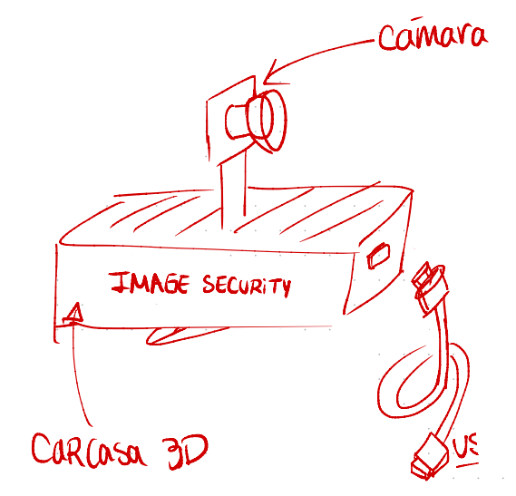

# ImageSecurity
Dispositivo IoT diseñadp para el curso Taller de diseño EL5004,  Universidad de Chile. Integrantes: Joaquin Zepeda, Benjamin Irarrazabal y Samuel Clavel.

Los archivos más importantes son index.html ubicado dentro de la carpeta ImageSecurityWebPage/public/. Además ahi se encuentran los códigos HTML, CSS y JS que hacen funcionar la página, dentro del archivo ImageSecurityWebPage/public/js se encuentran auth.js y app.js, el primero es el que funciona como autenticador, utilizando el que provee firebase por defecto y el segundo tiene las funciones que traen las imagenes desde la base de datos. 

